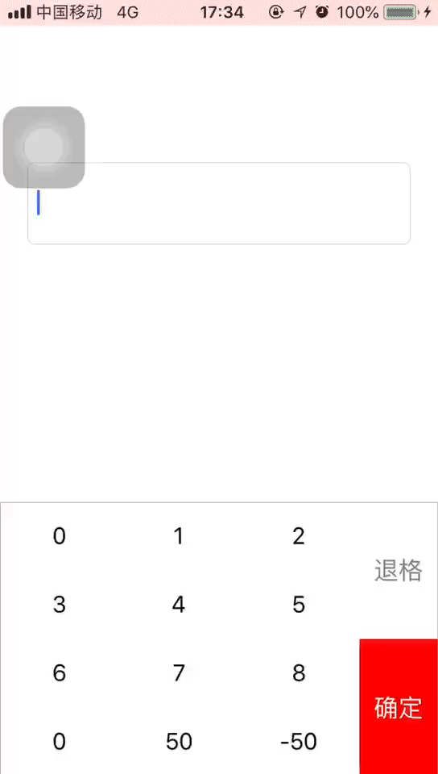
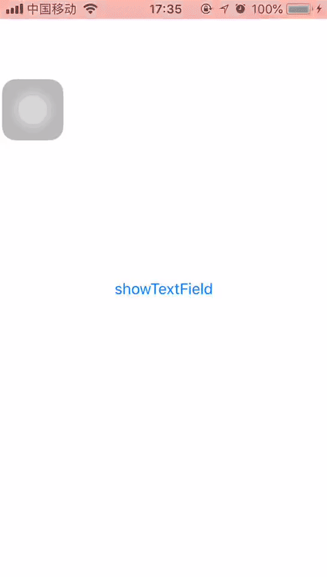

# PTDiagitalKeyBoard

iOS系统提供了多种键盘，我们可以通过Enum类型设置。但有的时候由于某些特殊业务的需要，我们不得不自定义键盘。

说到自定义键盘，就得说起`inputView`和`inputAccessoryView`了。

`inputView`是键盘的主体部分，`inputAccessoryView`则相当于键盘上的工具栏。

## UITextInput 协议

键盘构建的重点在于将输出的内容显示到输入框中。由于输入框都遵循了`<UITextInput>`协议，所以只需要根据协议来获取输入框相关状态、改变输入框的文本便可。

这里我们通过[UITextInput协议参考](http://blog.sina.com.cn/s/blog_5ff81ab001011s9m.html)，找到对应的协议方法，来对输入框文本做一些简单的更改。



```Objective-C
//退格
- (void)event_delete
{
    UIResponder <UITextInput>*firstResponse = (id)self.nextResponder;

    [firstResponse deleteBackward];
}

// 添加字符串
- (void)event_addCharacter:(NSString *)string
{
    UIResponder <UITextInput> *firstResponse = (id)self.nextResponder;

    UITextRange *range = firstResponse.selectedTextRange;
    if ([firstResponse respondsToSelector:@selector(shouldChangeTextInRange:replacementText:)] && [firstResponse shouldChangeTextInRange:range replacementText:string] == NO) {
        return;
    }
    [firstResponse replaceRange:range withText:string];
}
```

## 评论输入框

依据`inputAccessoryView`的特性，我们也可以将评论输入框 A 作为某中介输入框 B 的`inputAccessoryView`。

当输入框 B 成为第一响应者时，由于评论输入框 A 是输入框 B 的`inputAccessoryView`，因此其位于键盘的头部。

监听键盘弹出事件，在键盘将要弹出时把第一响应者嫁接给评论输入框 B。

这时，评论输入框 A既是第一响应者，又是键盘的`inputAccessoryView`。



```Objective-C
- (void)add_textField
{
    self.textField_keyword = [[UITextField alloc]initWithFrame:CGRectMake(0, 0, 0, 50)];
    self.textField_keyword.backgroundColor = [UIColor colorWithRed:170/255.0 green:170/255.0 blue:170/255.0 alpha:1];
    self.textField_keyword.leftView     = [[UIView alloc]initWithFrame:CGRectMake(0, 0, 20, 50)];
    self.textField_keyword.leftViewMode = UITextFieldViewModeAlways;
    self.textField_keyword.rightView    = [[UIView alloc]initWithFrame:CGRectMake(0, 0, 20, 50)];
    self.textField_keyword.rightViewMode= UITextFieldViewModeAlways;

    self.textField_temp = [[UITextField alloc]initWithFrame:CGRectZero];
    [self.view addSubview:self.textField_temp];
    self.textField_temp.inputAccessoryView = self.textField_keyword;
}
#pragma mark-textField event
- (void)keyboardWillShow
{
    [self.textField_keyword becomeFirstResponder];
}
- (IBAction)showTextInputView:(id)sender {
    [self.textField_temp becomeFirstResponder];
}

#pragma mark-life cycle
- (void)viewWillAppear:(BOOL)animated
{
    [super viewWillAppear:animated];
    [[NSNotificationCenter defaultCenter]addObserver:self selector:@selector(keyboardWillShow) name:UIKeyboardWillShowNotification object:nil];
}

- (void)viewWillDisappear:(BOOL)animated
{
    [super viewWillDisappear:animated];
    [[NSNotificationCenter defaultCenter]removeObserver:self];
}
```

[自定义输入法](http://www.cocoachina.com/ios/20140918/9677.html)


